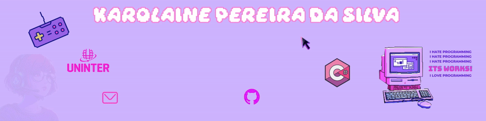
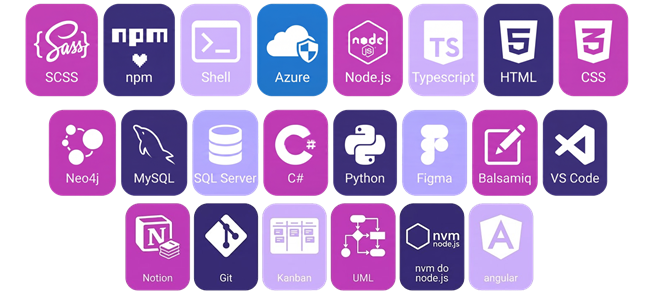

  
  
<b>Sou Desenvolvedora Full Stack em formação. Sou apaixonada por tecnologia desde os meus 7 anos de idade. Estou cursando Bacharel em Engenharia de Software na instituição Uninter/Centro Universitário Internacional. Antes de entrar na faculdade, tive meu primeiro contato com a programação através da linguagem C#, Banco de dados e SQL SERVER. Sou movida pelo desafio de aprender novas tecnologias e tenho objetivo de me profissionalizar no mundo da tecnologia!<b> 
##  Contato:
 

#  Tecnologias Utilizadas:

ㅤㅤㅤㅤㅤ
#  Estatísticas Github:

 &nbsp;&nbsp;&nbsp;&nbsp;&nbsp; 

<!-- Proudly created with GPRM ( https://gprm.itsvg.in ) -->
