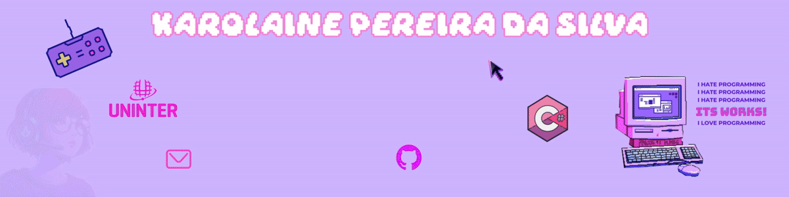
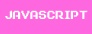

  
[+AO+MEU+GITHUB!%F0%9F%92%9C)](https://git.io/typing-svg)  
<b>Sou Desenvolvedora Back-End em formação. Sou apaixonada por tecnologia desde os meus 7 anos de idade. Estou cursando Bacharel em Engenharia de Software na instituição Uninter/Centro Universitário Internacional. Antes de entrar na faculdade, tive meu primeiro contato com a programação através da linguagem C#, Banco de dados e SQL SERVER. Sou movida pelo desafio de aprender novas tecnologias e tenho objetivo de me profissionalizar no mundo da tecnologia!<b> 
##  Contato:
 

#  Tecnologias Utilizadas:
    
#  Estatísticas Github:

 

 &nbsp;&nbsp;&nbsp;&nbsp;&nbsp; 

https://www.instagram.com/karou.png
https://www.linkedin.com/in/karolaine-pereir-40a169139/

<!-- Proudly created with GPRM ( https://gprm.itsvg.in ) -->
